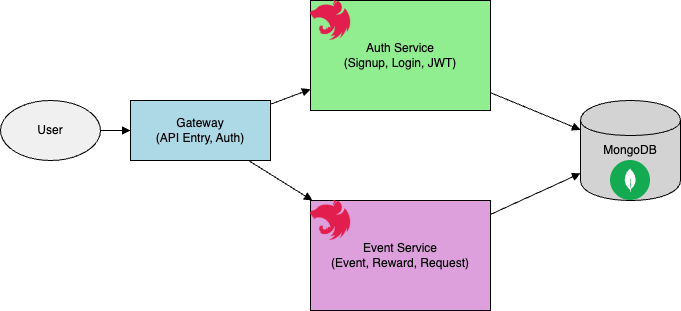

# maplestory-event-reward

NestJS 기반 MSA 프로젝트 – 메이플스토리 PC 백엔드 과제

이 프로젝트는 사용자 이벤트 조건 검증 및 보상 자동화를 위한 시스템이며, MSA 구조를 기반으로 Gateway, Auth, Event 세 개의 독립 서비스로 구성되어 있습니다.

## 실행 방법

```bash
docker compose up --build
```

- Gateway: http://localhost:3000
- Auth: http://localhost:3002
- Event: http://localhost:3001
- DB: MongoDB (localhost:27017)

---

## 시스템 구조



### 서비스 구성

- **Gateway**: 모든 요청의 진입점, JWT 인증 및 역할 기반 권한 검사
- **Auth**: 유저 등록, 로그인, JWT 발급
- **Event**: 이벤트 생성, 보상 등록, 보상 요청 처리
- **MongoDB**: 공통 DB로 사용

---

## 테스트 시나리오 (Postman)

1. 회원가입 (role 필수)

```json
POST /auth/signup
{
  "email": "user1@example.com",
  "password": "123456",
  "role": "USER"
}
```

2. 로그인 → accessToken 발급

```json
POST /auth/login
{
  "email": "user1@example.com",
  "password": "123456"
}
```

3. 이벤트 등록 (OPERATOR 전용)

```json
POST /event
Authorization: Bearer <operator_token>
{
  "title": "출석 이벤트",
  "condition": "7-days",
  "duration": "2025-05-20~2025-05-27",
  "active": true
}
```

4. 보상 등록

```json
POST /event/:id/rewards
Authorization: Bearer <operator_token>
{
  "name": "100포인트",
  "type": "POINT",
  "quantity": 100
}
```

5. 보상 요청 (USER 전용)

```json
POST /event/:id/rewards/request
Authorization: Bearer <user_token>
```

6. 요청 이력 확인 (AUDITOR or ADMIN)

```http
GET /event/:id/requests
Authorization: Bearer <auditor_token>
```

---

## 이슈 및 학습내용

### 초기 프로젝트 구조 및 경로 설정 이슈

- 현상: Nest CLI의 기본 설정(nest-cli.json)에서 `root` 값이 잘못되어 `dist/apps/app/src/main.ts` 등 잘못된 경로 참조 발생
- 해결: 각 프로젝트의 실제 위치(`apps/auth`, `apps/event`, `apps/gateway`)에 맞게 `root`, `sourceRoot`, `entryFile`을 수정

### Dockerfile CMD 경로 문제

- 현상: `CMD ["node", "dist/main"]` 등의 명령어에서 Nest 빌드 결과물이 실제 위치와 맞지 않아 앱이 실행되지 않음
- 해결: 각 서비스마다 `CMD`를 `dist/apps/<service>/main.js` 경로에 맞춰 수정

### Auth 단일 서버로 먼저 개발한 뒤 MSA 분리

- 진행 방식: 초기에 Auth 서버 하나로 모든 API 개발 후, 이후에 Event/Gateway로 분할하여 MSA 구조 완성
- 느낀점: 단일 서버로 기능을 먼저 완성한 뒤 점진적으로 마이크로서비스로 나누는 전략이 실현 가능성과 유지보수 측면에서 효율적이었음

### Docker 컨테이너 간 통신 오류 (ECONNREFUSED)

- 현상: Gateway가 Auth 또는 Event 서버에 Axios 요청 시 "connect ECONNREFUSED" 오류 발생
- 원인: docker-compose.yml 내 네트워크 미설정, 서비스 간 이름 해석 실패
- 해결: `networks: app-network` 명시 및 공통 브리지 네트워크 추가

### 컨테이너 내부 ping, curl 불가

- 현상: `docker compose exec gateway ping auth` 시 ping 명령어 없음 오류
- 해결: 대신 `curl`로 통신 확인. 필요 시 Dockerfile에 `iputils-ping` 설치 가능

### API 경로 404 (Cannot GET /auth/signup)

- 현상: Gateway에서 Auth 서버로 요청 시 404 Not Found
- 원인: Auth 서버에 `@Post('signup')`, `@Controller('auth')` 경로 미일치 또는 누락
- 해결: Gateway 요청 경로와 컨트롤러 경로 정합성 유지

### Mongoose ValidationError: role required

- 현상: 회원가입 요청 시 `role` 필드 누락 → 저장 실패
- 원인: Mongoose User Schema에 `role`이 required로 설정되어 있음
- 해결: 클라이언트에서 명시적으로 `role` 필드 포함 or 기본값 설정

### JWT 전역 가드로 인해 회원가입·로그인 차단

- 현상: Gateway에 `JwtAuthGuard`가 전역으로 등록되어 `/auth/signup`, `/auth/login`도 인증 필요함
- 해결: `@Public()` 데코레이터 도입하여 예외 설정

### Gateway 라우팅 구조 불일치

- 현상: Gateway에서 실제 Auth/Event 서버로의 라우팅 경로가 맞지 않아 통신 실패
- 해결: Gateway에서 HttpService를 통해 명시적으로 `http://auth:3002/...`, `http://event:3001/...`으로 포워딩 설정

### DTO import 경로 혼란

- 현상: 각 서비스마다 DTO가 중복 선언되거나 import 경로가 모호함
- 해결: `libs/common/src/dto/`로 DTO 통합 관리 후, 상대 경로로 명시적 import

### ESLint 오류 (no-unsafe-return 등)

- 현상: Gateway 컨트롤러에서 `res.data` 반환 시 타입 불명확으로 오류 발생
- 해결: `AxiosResponse<T>` → 명시적으로 `.pipe(map((res) => res.data as T))` 처리

### Gateway 인증 컨트롤러에서 로그인/회원가입 요청 시 401 Unauthorized

- 원인: 전역 가드로 보호된 상태에서 인증 요청이 JWT 없이 들어가 차단됨
- 해결: `@Public()` 처리 및 테스트 계정 분리

### ECONNREFUSED (Gateway → Auth)

- 원인: Docker 네트워크 설정 누락
- 해결: 모든 서비스에 `networks: app-network` 추가

### Gateway 컨테이너에서 `ping` 불가

- 해결: `curl` 명령어로 대체하여 통신 확인

### `404 Not Found` on `/auth/signup`

- 원인: Auth 서버에 `@Post('signup')` 경로 누락 또는 오타
- 해결: 컨트롤러 경로 및 등록 확인

### 회원가입 시 `role` 누락으로 저장 실패

- 원인: `role` 필드가 required
- 해결: 요청 시 `role` 필드 전달 or 스키마 기본값 지정

### JWT 전역 가드로 인해 로그인도 차단

- 해결: `@Public()` 데코레이터로 예외 지정

---

## ✨ 느낀점

### NestJS 기반 MSA 아키텍처 적용

- NestJS의 모듈 기반 구조 덕분에 서비스별 책임 분리가 명확해졌고, MSA 형태로도 자연스럽게 확장할 수 있었음.
- 초기에는 단일 서비스(Auth)로 개발을 시작한 뒤 점진적으로 Gateway, Event 서비스로 분리하면서 Nest의 유연한 DI 구조의 장점을 체감함.

### Docker 기반 서비스 연결과 운영 경험

- Docker를 활용한 서비스 분리는 개발/배포 환경을 명확히 구분할 수 있어 운영 효율성을 높임.
- 컨테이너 간 통신 오류(ECONNREFUSED)와 네트워크 지정 누락 등으로 인한 초기 연결 문제를 겪으며 Docker Compose 구성의 중요성을 체감함.

### 인증/인가 분리의 중요성

- `JwtAuthGuard`의 전역 적용은 보안 측면에선 유효하지만, 회원가입/로그인과 같이 인증이 필요 없는 라우트에는 예외 처리가 필요함을 깨달음.
- `@Public()` 데코레이터와 `RolesGuard`를 통해 실무적인 인증/인가 구조를 구현할 수 있었고, NestJS의 Guard 시스템에 대한 이해도가 높아졌음.

### 개발 전략과 단계적 구조 분리

- 처음부터 MSA로 시작하기보다, Auth 단일 서비스로 전체 플로우를 완성한 후 단계적으로 Event, Gateway로 분리하는 전략이 매우 효과적이었음.
- 이는 문제 해결에 집중할 수 있게 해주었고, MSA 전환 시 발생할 수 있는 복잡도를 완화하는 데 도움이 되었음.

### 코드 품질과 Lint 규칙 적용

- ESLint의 `@typescript-eslint/no-unsafe-return` 경고를 해결하면서 타입 안정성과 명시적 반환 타입의 중요성을 느꼈음.
- 명확한 DTO 정의, `AxiosResponse` 타입 처리 등을 통해 유지보수성과 안정성을 높일 수 있었음.

- NestJS의 모듈화 구조가 MSA에 적합하다는 점을 다시 확인했습니다.
- Docker 네트워크와 서비스 간 통신 흐름을 명확히 이해하는 것이 중요했습니다.
- 인증/인가의 흐름을 명확하게 분리하는 것이 전체 아키텍처를 견고하게 만듭니다.

---

## TODO / 미해결 사항

- [ ] 이벤트 조건 로직은 현재 하드코딩 상태 (ex: 7일 출석 등 자동 판별 X)
- [ ] 테스트 코드 미작성 (E2E 테스트 도입 고려)
- [ ] 사용자 역할 관리 UI/관리자 페이지 미구현
